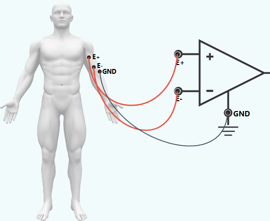
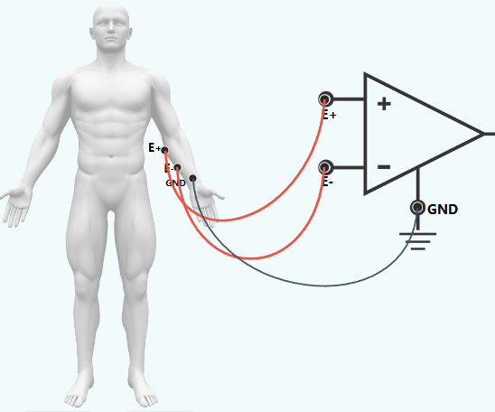
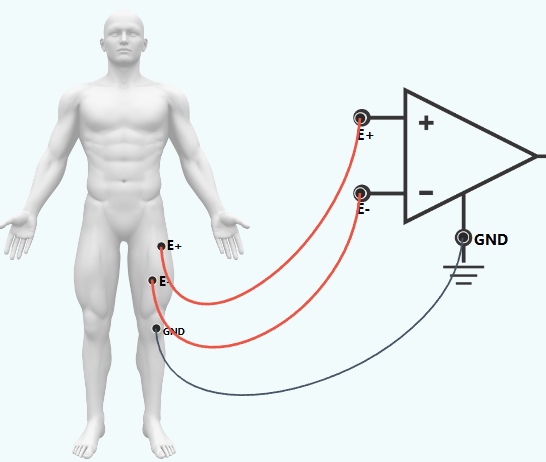
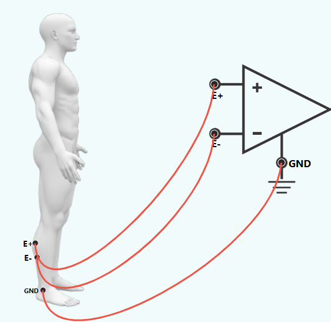

<h3> Procedure for EMG Acquisition</h3>
<h4> 1. from Biceps (Elbow Flexion):</h4>

<b>Step 1: Establish connections</b> 

1. Connect the E+ electrode on Biceps to the positive input (E+) of the op-amp circuit. 
2. Connect the E- electrode on Biceps to the negative terminal (E-) of first op-amp circuit. 
3. Connect the GRD electrode nearby bony landmark to the ground (GRD) of the op-amp circuit. 

<b>Step 2:</b>
Refer to the accompanying figure for correct connection points. 

 

<b>Step 3:</b>
Click the <b>Check</b> button to verify correct connections. 

<b>Step 4:</b>
 Click the <b>show signal</b> button to display the simulated EMG waveform. 

<b>Step 5:</b>
Click the <b>Normal</b> button to observe the baseline EMG signal when the muscle is relaxed. Then click the <b>Contraction</b> button to simulate muscle Contraction and observe the increase in EMG amplitude.

<b>Step 6:</b>
Click the <b>Signal</b> button to pause the displayed EMG waveform. 
 
<b>Step 7:</b>
Click the <b>Print</b> button to save the record observations. 
 
<b>Step 8:</b>
Select another muscle from the left panel to record EMG Signals for its corresponding muscle.
 <!-- forarm flexors grip -->
 <h4> 2.EMG Acquisition from Forearm Flexors (Grip):</h4>

<b>Step 1: Establish connections</b> 

1. Connect the E+ electrode on Forearm Flexors to the positive input (E+) of the op-amp circuit. 
2. Connect the E- electrode on Forearm Flexors to the negative terminal (E-) of first op-amp circuit. 
3. Connect the GRD electrode nearby bony landmark to the ground (GRD) of the op-amp circuit. 

<b>Step 2:</b>
Refer to the accompanying figure for correct connection points. 

 

<b>Step 3:</b>
Click the <b>Check</b> button to verify correct connections. 

<b>Step 4:</b>
 Click the <b>show signal</b> button to display the simulated EMG waveform. 

<b>Step 5:</b>
Click the <b>Normal</b> button to observe the baseline EMG signal when the muscle is relaxed. Then click the <b>Contraction</b> button to simulate muscle Contraction and observe the increase in EMG amplitude.

<b>Step 6:</b>
Click the <b>Signal</b> button to pause the displayed EMG waveform. 
 
<b>Step 7:</b>
Click the <b>Print</b> button to save the record observations. 
 
<b>Step 8:</b>
Select another muscle from the left panel to record EMG Signals for its corresponding muscle.
 <!-- quadriceps -->
 <h4> 3.EMG Acquisition from Quadriceps (Knee Extension):</h4>

<b>Step 1: Establish connections</b> 

1. Connect the E+ electrode on Quadriceps to the positive input (E+) of the op-amp circuit. 
2. Connect the E- electrode on Quadriceps to the negative terminal (E-) of first op-amp circuit. 
3. Connect the GRD electrode nearby bony landmark to the ground (GRD) of the op-amp circuit. 

<b>Step 2:</b>
Refer to the accompanying figure for correct connection points. 

 

<b>Step 3:</b>
Click the <b>Check</b> button to verify correct connections. 

<b>Step 4:</b>
 Click the <b>show signal</b> button to display the simulated EMG waveform. 

<b>Step 5:</b>
Click the <b>Normal</b> button to observe the baseline EMG signal when the muscle is relaxed. Then click the <b>Contraction</b> button to simulate muscle Contraction and observe the increase in EMG amplitude.

<b>Step 6:</b>
Click the <b>Signal</b> button to pause the displayed EMG waveform. 
 
 
<b>Step 7:</b>
Click the <b>Print</b> button to save the record observations. 
 
<b>Step 8:</b>
Select another muscle from the left panel to record EMG Signals for its corresponding muscle.
 <!-- calfrasie -->
 <h4>4.EMG Acquisition from Gastrocnemius (Calf Raise):</h4>

<b>Step 1: Establish connections</b> 

1. Connect the E+ electrode on Gastrocnemius to the positive input (E+) of the op-amp circuit. 
2. Connect the E- electrode on Gastrocnemius to the negative terminal (E-) of first op-amp circuit. 
3. Connect the GRD electrode nearby bony landmark to the ground (GRD) of the op-amp circuit. 

<b>Step 2:</b>
Refer to the accompanying figure for correct connection points. 

 

<b>Step 3:</b>
Click the <b>Check</b> button to verify correct connections. 

<b>Step 4:</b>
 Click the <b>show signal</b> button to display the simulated EMG waveform. 

<b>Step 5:</b>
Click the <b>Normal</b> button to observe the baseline EMG signal when the muscle is relaxed. Then click the <b>Contraction</b> button to simulate muscle Contraction and observe the increase in EMG amplitude.

<b>Step 6:</b>
Click the <b>Signal</b> button to pause the displayed EMG waveform. 
 
 
<b>Step 7:</b>
Click the <b>Print</b> button to save the record observations. 
 
<b>Step 8:</b>
Select another muscle from the left panel to record EMG Signals for its corresponding muscle.
