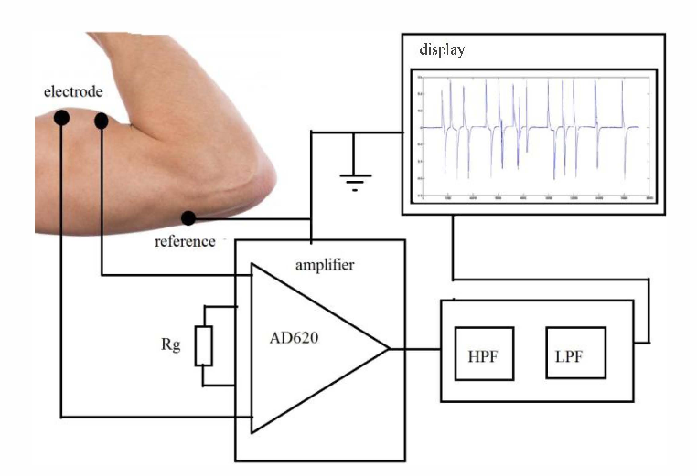
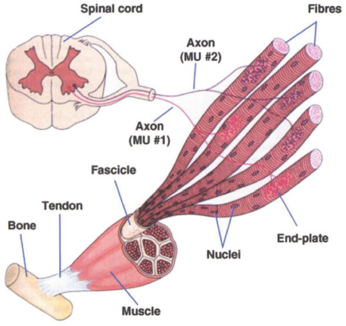
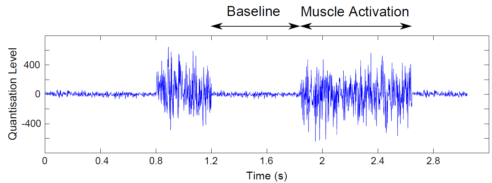

<h4>Introduction</h4>

The electromyogram (EMG) is the recording of the electrical activity produced by skeletal muscles during contraction and relaxation. These signals arise from the depolarization and repolarization of muscle fibers, reflecting the summed action potentials of motor units. Like neurons, skeletal muscle fibers generate action potentials when excited by motor neurons via the motor end plates. The measurement of these action potentials, either directly from the muscle or from the surface of the body, constitutes the electromyogram.

<h4>Generation of EMG Signals</h4>

EMG signal is generated by the electrical activity of the muscle fibers active during a contraction. The signal sources located at the depolarized zones of the muscle fibers are separated from the recording electrodes by biological tissues, which act as spatial low-pass filters on the (spatial) potential distribution. It is closely related to muscle activity, muscle size and a measure of the functional state of muscle fibres. This section presents a brief explanation about the anatomy, physiology and the electrical properties of the muscle and the composition of EMG.

 

<b>Figure-1: EMG acquisition and display</b>
 

<h4>Physiological Basis of EMG Signal</h4>

The Electromyogram (EMG) represents the electrical activity produced by a contracting muscle. EMG signals are widely used in the fields of rehabilitation, biomechanics, orthopedics, ergonomic design, and prosthetic control. Because EMG allows direct observation of muscle activity, it is valuable for assessing muscular performance and aiding clinical decision-making before and after surgery. The fundamental functional element responsible for generating EMG signals is the Motor Unit (MU).

A motor unit consists of an α-motor neuron located in the spinal cord and the group of skeletal muscle fibers it innervates. The α-motor neuron extends its axon from the spinal cord to the muscle fiber, forming synaptic connections known as motor end plates, as shown in Figure 2.

 

<b>Figure-2:A typical α-motor neuron extending from the spinal cord and ending at the motor end plates of skeletal muscle fibers.</b>
 

When an electrical impulse travels down the α-motor neuron, it triggers depolarization in the muscle fibers connected to it. This depolarization propagates along the muscle fibers in both directions from the junction, producing a potential difference that can be detected by electrodes. All fibers controlled by a single neuron contract together, forming a motor unit action potential (MUP). The recorded EMG signal is therefore the summation of all active motor unit action potentials (MUAPs) during muscle contraction. When surface electrodes are used, the EMG signal must pass through layers of tissue, fat, and skin, which attenuate its amplitude before reaching the recording site.

<h4>EMG Measurement Techniques</h4>
<ul>
  <li><b>Surface electrodes:</b> It is Placed on the skin above the muscle group and then captures activity from multiple fibers. It is generally used where gross indications are suitable. Surface electrodes are generally used where gross indications are suitable, but where localized measurement of specific muscles is required.
</li>

 

<b>Figure-3: Disposable electrodes</b>
 
  <li><b>Needle electrodes:</b> It is Inserted directly into the muscle tissue for localized recording, It is useful where localized measurement of specific muscles is required. There are three subtypes of needle electrodes: mono-polar single electrodes, single-fiber EMG electrodes, and concentric-EMG electrodes. Due to the proximity of the needle to the muscle surface, this is a more accurate and reliable method used for clinical diagnostic purposes.</li>

 

<b>Figure-4: Needle electrodes</b>
 
</ul>
<h4>Nature and Characteristics of EMG Signal</h4>

The EMG potentials from a muscle or group of muscles produce a noiselike waveform that varies in amplitude with the amount of muscular activity. Peak amplitudes vary from 50 µV to about 1 mV, depending on the location of the measuring electrodes with respect to the muscle and the activity of the muscle. A frequency response from about 10 Hz to well over 3000 Hz is required for faithful reproduction.

<h4>Resting Muscle State</h4>

At rest, EMG signals are minimal, showing very low amplitude, typically below 10 µV. The signal primarily consists of baseline noise, which may arise from environmental interference or minor involuntary muscle tone. There is an absence of significant electrical activity as the muscle remains inactive, reflecting no voluntary contraction.

<h4>Active Muscle State</h4>

During muscle contraction, EMG signals become prominent, with sharp spikes and a higher amplitude ranging from 50 µV to several millivolts. The frequency spectrum broadens to between 10–500 Hz, and the signal displays bursts of activity. These spikes result from synchronized firing of motor units, indicating the muscle's active engagement and contraction strength.

 

<b>Figure-5: ElectroMyoGram (EMG) waveform</b>
 

<h4>Clinical and Research Applications</h4>
<ul>
  <li>Assessment of muscle contraction intensity and timing</li>
  <li>Diagnosis of neuromuscular disorders (e.g., myasthenia gravis, neuropathies, muscular dystrophy)</li>
  <li>Evaluation of muscle fatigue and recovery</li>
  <li>Monitoring during rehabilitation therapy</li>
  <li>Control input for prosthetic and robotic limb systems</li>
</ul>

